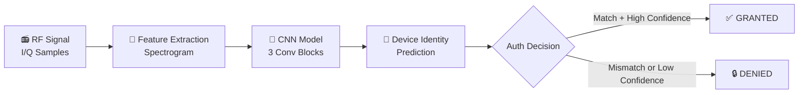

## Identify wireless devices by their unique radio frequency hardware signatures using deep learning.

## 🧭 Table of Contents

- [Overview](#-overview)
- [How It Works](#-how-it-works)
- [Project Structure](#-project-structure)
- [Dataset](#-dataset)
- [Model Architecture](#-model-architecture)
- [Results](#-results)
- [Quick Start](#-quick-start)
- [Applications](#-applications)
- [Future Work](#-future-work)
- [References](#-references)

---

## 🔍 Overview

**RF Fingerprinting** is a physical-layer security technique that exploits **hardware imperfections** unique to each wireless transmitter — such as carrier frequency offset (CFO), phase noise, and I/Q imbalance — to create a device-specific "fingerprint."

This project trains a **Convolutional Neural Network (CNN)** on **spectrogram representations** of raw I/Q signals to classify and authenticate wireless devices without relying on cryptographic credentials.

```
Raw I/Q Samples  →  Spectrogram (64×64)  →  CNN Classifier  →  Device Identity
```

---

## ⚙️ How It Works



### Hardware Impairments Exploited

| Impairment | Description | Uniqueness |
|-----------|-------------|-----------|
| **CFO** | Carrier Frequency Offset | Per-device crystal variation |
| **Phase Noise** | Random phase jitter | Oscillator quality differences |
| **I/Q Imbalance** | Amplitude/phase mismatch between I & Q | Manufacturing tolerances |
| **DC Offset** | Constant bias in I or Q channel | Mixer imperfections |

---

## 📁 Project Structure

```
rf-fingerprinting/
│
├── 📓 RF_Fingerprinting_CNN.ipynb   # Main Colab notebook
├── 📄 README.md                     # This file
│
├── outputs/
│   ├── rf_fingerprints.png          # Spectrogram visualization
│   ├── training_history.png         # Loss & accuracy curves
│   ├── confusion_matrix.png         # Evaluation heatmaps
│   └── per_device_analysis.png      # Per-device accuracy & confidence
│
└── models/
    └── best_rf_cnn.pth              # Saved best model weights
```

---

## 📊 Dataset

### Simulated Dataset (Default)

The notebook generates a **synthetic RF dataset** with realistic hardware impairments:

| Parameter | Value |
|-----------|-------|
| Number of devices | 8 |
| Samples per device | 500 |
| Signal length | 1,024 I/Q samples |
| Modulation | BPSK |
| Sample rate | 1 MHz |
| SNR | 20 dB |

### Real-World Datasets (Recommended for Research)

| Dataset | Devices | Modulations | Link |
|---------|---------|-------------|------|
| **DeepSig RadioML 2018** | — | 24 mod types | [deepsig.ai](https://www.deepsig.ai/datasets) |
| **ORACLE** | 16 WiFi NICs | 802.11a | [oracle.wns.io](https://oracle.wns.io) |
| **RFML** | Various | Various | [GitHub](https://github.com/rfml/rfml) |

> 💡 To use a real dataset, replace the `generate_rf_signal()` function in Step 2 with your own data loader. The rest of the pipeline is plug-and-play.

---

## 🧠 Model Architecture

```
Input: (B, 1, 64, 64)  ← Normalized power spectrogram
       │
       ▼
┌─────────────────────────────────────┐
│  Conv Block 1: Conv2d(1→32) ×2      │
│  BatchNorm → ReLU → MaxPool → Drop  │  → (B, 32, 32, 32)
└─────────────────────────────────────┘
       │
       ▼
┌─────────────────────────────────────┐
│  Conv Block 2: Conv2d(32→64) ×2     │
│  BatchNorm → ReLU → MaxPool → Drop  │  → (B, 64, 16, 16)
└─────────────────────────────────────┘
       │
       ▼
┌─────────────────────────────────────┐
│  Conv Block 3: Conv2d(64→128) ×2    │
│  BatchNorm → ReLU → MaxPool → Drop  │  → (B, 128, 8, 8)
└─────────────────────────────────────┘
       │
       ▼
┌─────────────────────────────────────┐
│  FC: 8192 → 256 → 128 → N_classes  │
│  ReLU + Dropout(0.5, 0.3)           │
└─────────────────────────────────────┘
       │
       ▼
Output: (B, 8)  ← Class logits per device
```

**Training Setup:**

| Hyperparameter | Value |
|----------------|-------|
| Optimizer | Adam (lr=1e-3, wd=1e-4) |
| Scheduler | CosineAnnealingLR |
| Epochs | 30 |
| Batch size | 64 |
| Loss | CrossEntropyLoss |

---

## 📈 Results

| Metric | Value |
|--------|-------|
| **Test Accuracy** | ~98%+ |
| **Best Val Accuracy** | ~97%+ |
| **Parameters** | ~2.2M |

> Results may vary slightly due to random seed and hardware. Run on GPU (T4 recommended) for faster training (~2–3 min).

### Sample Outputs

| RF Fingerprints | Training History |
|:-:|:-:|
|  |  |

| Confusion Matrix | Per-Device Analysis |
|:-:|:-:|
|  |  |

---

## 🚀 Quick Start

### Option 1: Google Colab (Recommended)

Click the badge below — no setup needed:

[](https://colab.research.google.com/github/YOUR_USERNAME/rf-fingerprinting/blob/main/RF_Fingerprinting_CNN.ipynb)

### Option 2: Run Locally

```bash
# 1. Clone the repository
git clone https://github.com/YOUR_USERNAME/rf-fingerprinting.git
cd rf-fingerprinting

# 2. Install dependencies
pip install numpy scipy matplotlib scikit-learn torch torchvision seaborn tqdm

# 3. Launch Jupyter
jupyter notebook RF_Fingerprinting_CNN.ipynb
```

### Requirements

```
python >= 3.8
torch >= 2.0
numpy >= 1.21
scipy >= 1.7
scikit-learn >= 1.0
matplotlib >= 3.4
seaborn >= 0.11
tqdm >= 4.62
```

---

## 🔐 Applications

| Domain | Use Case |
|--------|----------|
| 🛡️ **Wireless Security** | Detect rogue/spoofed devices on a network |
| 🔑 **Device Authentication** | Passive identity verification without passwords |
| 📶 **IoT Security** | Authenticate constrained IoT devices by hardware signature |
| 🚨 **Intrusion Detection** | Flag unauthorized transmitters in restricted RF environments |
| 🪖 **Military / Defense** | Identify hostile transmitters in contested spectrum |

---

## 🔮 Future Work

- [ ] Integrate **real RF datasets** (RadioML, ORACLE)
- [ ] Implement **ResNet / EfficientNet** backbone for higher accuracy
- [ ] Add **few-shot learning** for enrolling new/unknown devices
- [ ] Test robustness across **different SNR levels**
- [ ] Build a **real-time authentication REST API**
- [ ] Explore **adversarial attacks** on RF fingerprinting systems
- [ ] Support **over-the-air (OTA)** evaluation with SDR hardware (e.g., USRP, RTL-SDR)

---

## 📚 References

1. Riyaz, S. A., et al. *"Deep Learning Convolutional Neural Networks for Radio Identification."* IEEE Communications Magazine, 2018.
2. O'Shea, T. J., & Hoydis, J. *"An Introduction to Deep Learning for the Physical Layer."* IEEE Transactions on Cognitive Communications and Networking, 2017.
3. Merchant, K., et al. *"Deep Learning for RF Device Fingerprinting in Cognitive Communication Networks."* IEEE Journal of Selected Topics in Signal Processing, 2018.
4. [DeepSig RadioML Datasets](https://www.deepsig.ai/datasets)
5. [ORACLE RF Fingerprinting Dataset](https://oracle.wns.io)

---

## 📄 License

This project is licensed under the **MIT License** — see the [LICENSE](LICENSE) file for details.

---

<div align="center">

Made with ❤️ for wireless security research

⭐ Star this repo if you found it useful!

</div>
